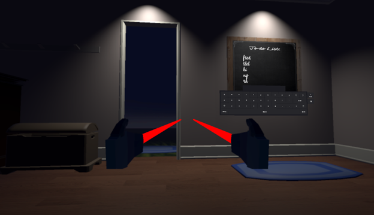

# At-Night
*VIS 143 VR final project presented by Jinyu Li, Meihui Liu, and Yuming Ma.* \
*Open in Unity Hub with Editor Version 2022.3.13f1* \
*Intended for Meta Quest 2*

## Project Purpose
Our project is called **At Night**. The idea of this project originated from restless nights that people face because of anxiety. People sometimes feel overwhelmed by life because of their unpredictable future and unfinished tasks due to procrastination. This stressful feeling is significantly obvious at night, as all of these unfinished things would be stuck in their head, making them feel intimidated from starting a new day. Some people choose to relieve their anxiety by spending more time on phones and games, or even by using medication. However, these distractions can only temporarily relieve stress. Only by taking actions, such as making a plan for themselves, can encourage them to be productive, thus reducing stress from its root. 

In this project, our purpose is to develop a VR game about anxiety and procrastination, hoping to convey the feeling of anxiety and make the players realize that they shouldn’t be escaping reality by immersing themselves in virtual environments. Instead, they should be productive, taking off the VR headset to accomplish things scheduled for each day to reduce their stress.

## Project Highlights
- **Visual Distortion:** To immerse players in the world of someone who is facing anxiety due to procrastination, we added some visual distortion (ripple effects) to the room.
- **Sound Effect:** We also added a rainy storm sound to couple with the ripple effect when the user takes no actions. In contrast, a calm nature sound is played when the user grabs an object or is typing at the blackboard to couple with the ripple effect soothing. Additional sound effects include light turning on, door opening, and object grabbing.
- **Light and UI Hints:** This room is meant to let the players explore the room without providing too many hints – players need to figure out what they can do to reduce stress by themselves and find which method is beneficial. However, since we also don’t want the players to feel lost in the game, we added point lights above some objects as hints to imply that the players may want to explore those objects. Some UIs we put in the room would also guide the players to determine a better way to reduce stress.
- **User Input:** Users can use a virtual keyboard to add inputs on the blackboard, which makes the game more interactive and aligns with our intentions of allowing the user to become organized through a personalized to-do list.

## Project Progress
Firstly, we gathered together to determine which proposal we would like to focus on for the rest of the quarter. By setting this common goal up, we proceeded to determine how we wanted to develop the game in general, such as deciding whether to use version control, what the overall game goal is, and what the game flow is. After everything has been determined, we began to create the actual game in the Unity engine.

Because all three of us have no experience with developing games in Unity, the whole development process depends heavily on searching the Internet and finding suitable tutorials from which we can learn.

We started off by creating a basic room following the Unity VR tutorials. The first challenge we encountered was figuring out how exactly we wanted our game to be executed and the intentions for each object we placed in the room. We reached an initial conclusion on this that allows us to proceed forward, but we continue to adjust the direction of our project as some of our initial ideas become too complex for us to execute in three weeks.

The second major challenge we faced was making the UI appear and disappear based on the retrieval of an object or after completion of tasks. Initially, we thought we only needed to use UI buttons to turn the UIs on and off. However, after some researching, we realized that we needed to complete our desired output through C#. For most of the UIs, its “GameObject.SetActive()” is set to be false initially and true after the object is grabbed to create a smooth UI experience for players. Similarly, we used this coding method for the lights at the blackboard and at the door to be off initially and turn on only after the user has attempted the other objects.

Another major challenge we encountered was allowing the player to open the door after finishing all the game tasks. A door can easily be set open through rotation and simple event system implementation. However, in order to open the door at the correct timing, we needed to ensure that the door would not open until the player completed all the possible tasks. We were stuck on this implementation for many days and finally found out that we needed some interaction between a “key” and a “door” game object to achieve our goal.

## Contribution
- **Gamer:** Jinyu Li, Meihui Liu, and Yuming Ma
- **Designer:** Jinyu Li, Meihui Liu, and Yuming Ma
- **Programmer:** Jinyu Li, Meihui Liu, and Yuming Ma
- **Sound person:** Jinyu Li, Meihui Liu, and Yuming Ma
- **Communicator:** Jinyu Li, Meihui Liu, and Yuming Ma

## Demo
Video: [Walkthrough Demo](https://www.youtube.com/watch?v=nJVzg-xW6qE)

Step 1: Welcome UI \

Step 2: Navigate to the chair, observe notebook and tablet on the table \

Step 3: Grab notebook and tablet to trigger corresponding UIs \

Step 4: Turn to face the bed and observe the pillow on the rug \

Step 5: Grab the pillow to trigger its UI \

Step 6: Navigate to the nightstand and observe the pill on the nightstand \

Step 7: Grab the pill to trigger its UI \

Step 8: Face away from the bed and observe the light turn on at the blackboard \

Step 9: Navigate to the blue rug and observe the blackboard UI \

Step 10: Click “OK” to remove the UI and start typing on the blackboard \

Step 11: Once finished making five plans, should be able to see the door light turn on and an UI informing a successful escape from the stress room \

Step 12: Click “Open Door” and navigate to the blue rug to step outside \

Step 13: Enjoy the beautiful night sky view outside! \

## Reference
- Locomotion setup: 
    - https://learn.unity.com/tutorial/vr-locomotion-1?uv=2020.3&courseId=60183276edbc2a2e6c4c7dae&projectId=60183335edbc2a2e6c4c7dcb
- Grab objects: 
    - https://learn.unity.com/tutorial/grabbable-objects-1?uv=2020.3&courseId=60183276edbc2a2e6c4c7dae&projectId=60183335edbc2a2e6c4c7dcb
- UI Creation: 
    - https://learn.unity.com/tutorial/2-4-user-interface-1?uv=2020.3&courseId=60183276edbc2a2e6c4c7dae&projectId=601834b9edbc2a4418546660
- Open door when a button/key is pressed/found: 
    - https://www.youtube.com/watch?v=8nuJT1IDazo&t=10s
    - https://www.youtube.com/watch?v=SlEgvvNYXQU&t=366s
- Add audio when clicking an object or when opening the door: 
    - https://learn.unity.com/tutorial/2-1-audio-and-haptics-1?uv=2020.3&courseId=60183276edbc2a2e6c4c7dae&projectId=601834b9edbc2a4418546660#602337d3edbc2a4e1667c64f
    - https://learn.unity.com/tutorial/2-2-activation-events-1?uv=2020.3&courseId=60183276edbc2a2e6c4c7dae&projectId=601834b9edbc2a4418546660#6023388fedbc2a0f094364f5
